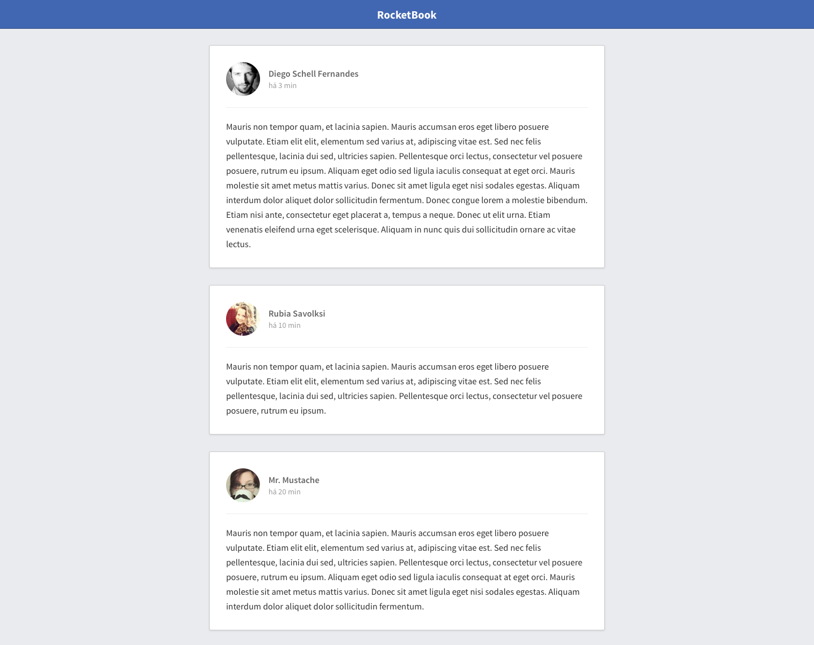

# Desafio 1

Configure uma estrutura ReactJS do zero com Babel, Webpack e Webpack Dev Server. Além disso, utilize as ferramentas ESLint, EditorConfig e Prettier durante o desenvolvimento desse projeto. 

Nesse projeto você desenvolverá um feed de posts estilo Facebook. Crie um layout tentando chegar o mais próximo possível da imagem abaixo:

## Regras

- O Header deve ser um componente separado;
- O Post deve ser um componente separado;
- O header do post aonde estão o avatar, nome e tempo do post devem estar em um componente separado chamado PostHeader;
- Os posts devem estar armazenado no estado (state) do arquivo principal App.js;
- Você deve passar a informação dos posts como uma única propriedade para o componente de Post quando realizar o map no state de posts: <Post data={post} />;

## Resultado

Para verificar o resultado, basta clonar o repositório e inserir o comando *npm install* seguido de *npm run dev*
